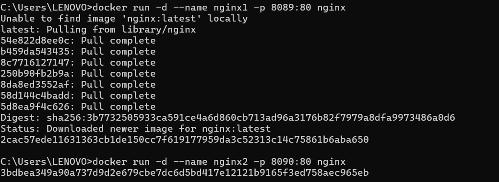
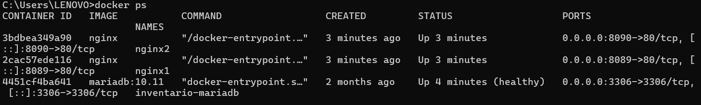
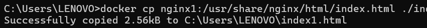
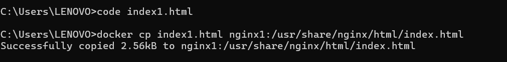
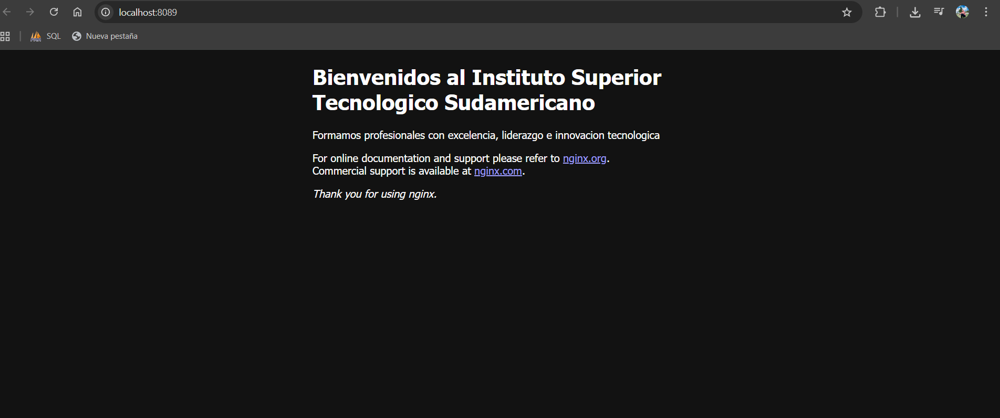
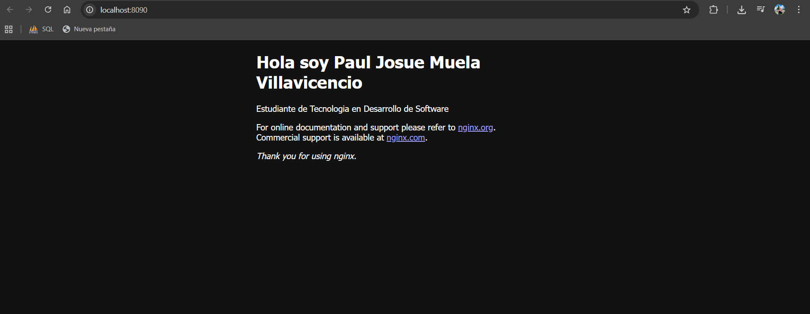

# Práctica: Creación y Personalización de Servidores Web con Nginx Usando Docker

## 1. Título
Despliegue y Personalización de Servidores Web con Nginx Usando Contenedores Docker

## 2. Tiempo de duración
30 minutos

## 3. Fundamentos

En la actualidad, la virtualización y la contenedorización se han convertido en herramientas esenciales para el desarrollo y despliegue de aplicaciones. Docker es una plataforma que permite empaquetar una aplicación con todas sus dependencias dentro de un contenedor, asegurando que se ejecute de manera uniforme en cualquier sistema operativo.

Un contenedor es una unidad ligera, portátil y aislada de software que contiene todo lo necesario para ejecutar una aplicación: código, librerías y configuraciones. A diferencia de las máquinas virtuales, los contenedores comparten el mismo kernel del sistema operativo, lo que los hace más eficientes en recursos y más rápidos de iniciar.

Nginx es un servidor web de alto rendimiento que se utiliza para servir contenido estático y dinámico, así como para actuar como proxy inverso o balanceador de carga. En esta práctica, se utilizó la imagen oficial de Nginx desde Docker Hub, permitiendo desplegar rápidamente servidores web sin necesidad de instalar Nginx manualmente en el sistema anfitrión.

Los comandos principales de Docker utilizados incluyen:

docker run → para crear y ejecutar contenedores.

docker ps → para listar contenedores activos.

docker cp → para copiar archivos hacia y desde un contenedor.

docker restart → para reiniciar contenedores y aplicar cambios.

## 4. Conocimientos previos

Para realizar esta práctica, el estudiante necesita tener conocimientos de:  
- Comandos básicos de Linux (`ls`, `cd`, `nano`, `cp`).  
- Uso de navegadores web.  
- Conceptos de contenedores y virtualización.  
- Manejo básico de Docker (`run`, `ps`, `cp`, `restart`).  
- Edición de archivos HTML y conceptos de páginas web.

## 5. Objetivos a alcanzar

- Implementar contenedores con Nginx para desplegar servidores web independientes.  
- Personalizar el contenido web mediante edición del archivo `index.html`.  
- Exponer contenedores en diferentes puertos y comprobar su funcionamiento en el navegador.  
- Comprender el manejo básico de Docker y la manipulación de archivos dentro de contenedores.

## 6. Equipo necesario

- Computador con sistema operativo Windows, Linux o macOS.  
- Docker.
- Navegador web (Chrome, Firefox, Edge, etc.).  
- Editor de texto o IDE (VS Code, Sublime, Nano, Vim).

## 7. Material de apoyo
 
- Guía de la asignatura sobre contenedores y Nginx.  
- Cheat sheet de comandos básicos de Linux.  
- Tutoriales oficiales de Nginx.

## 8. Procedimiento

**Paso 1:** Crear contenedor Nginx institucional y personal.

**Figura 1-1.** Crear contenedor

**Paso 2:** Verificar contenedores en ejecución.

**Figura 1-2.** Verificacion 

**Paso 3:** Copiar archivo index.html al host.

**Figura 1-3.** Copiar archivo

**Paso 4:** Editar los archivos html en VS Code y copiar archivos editados de vuelta al contenedor.

**Figura 1-4.** Editar

**Paso 5:** Probar en el navegador. 

http://localhost:8089 → contenido institucional.

http://localhost:8090 → contenido personal. 

## 9. Resultados esperados

- Dos servidores web funcionando en diferentes puertos.
- Contenido de cada contenedor personalizado según la práctica.

**Figura 1-5.** Página institucional en http://localhost:8089.

**Figura 1-6.** Página personal en http://localhost:8090.

## 10. Bibliografia
Nginx. (2023). Nginx Documentation. Retrieved from https://nginx.org/en/docs/

Docker Inc. (2023). Docker Documentation. Retrieved from https://docs.docker.com